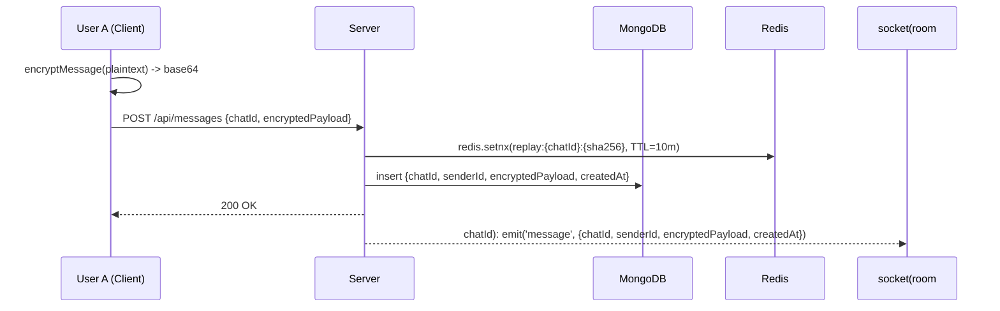
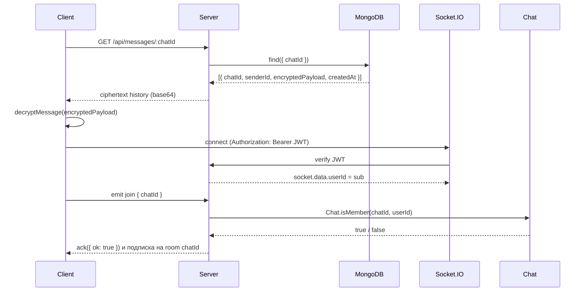

# Архитектура

Проект состоит из двух основных пакетов и вспомогательной инфраструктуры:

- **client/** — одностраничное приложение на React, которое шифрует все сообщения в Web Worker до отправки и расшифровывает историю после получения из API.【F:client/src/crypto/signal.js†L1-L120】【F:client/src/api/api.js†L1-L40】
- **server/** — приложение на Express, которое принимает только base64-шифротекст, применяет защиту от повторов и ретранслирует события в комнаты Socket.IO. Оно не хранит и не обрабатывает открытый текст.【F:server/src/routes/messages.js†L1-L95】【F:server/src/app.js†L1-L118】
- **MongoDB** — хранилище сообщений и структур чатов. В сообщениях есть только `chatId`, `senderId` и `encryptedPayload` плюс метаданные времени.【F:server/src/models/Message.js†L1-L16】
- **Redis** — используется для защиты от повторной доставки, в ключах хранится только хеш шифротекста и идентификатор чата.【F:server/src/services/replayGuard.js†L1-L67】

## Диаграмма компонентов

```mermaid
graph TD
  A[Client (React + WebCrypto + Signal Worker)] -->|REST /auth,/keybundle,/messages| B[Server (Express)]
  A -->|Socket.IO (JWT)| B
  B -->|ciphertext only| C[(MongoDB)]
  B -->|replay digests| D[(Redis)]
```

## Последовательность: отправка сообщения



## Последовательность: загрузка истории и handshake сокетов


